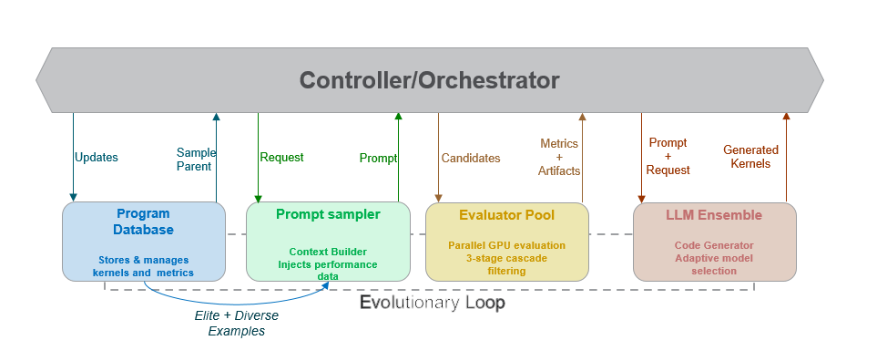

# GEAK-OpenEvolve

**A Framework for Automated GPU Kernel Optimization using LLM-Guided Code Evolution**

GEAK-OpenEvolve is an evolutionary coding agent(inspired by [OpenEvolve](https://github.com/algorithmicsuperintelligence/openevolve) and [AlphaEvolve](https://deepmind.google/blog/alphaevolve-a-gemini-powered-coding-agent-for-designing-advanced-algorithms/)) that automatically optimizes GPU kernels using Large Language Models (LLMs). Built on the OpenEvolve framework, it leverages island-based evolutionary algorithms combined with LLM-guided mutations to generate high-performance Triton kernels for AMD GPUs.

---

## 🌟 Features

- **LLM-Guided Evolution**: Utilizes state-of-the-art LLMs (Claude, GPT-4, etc.) to intelligently mutate and improve GPU kernels
- **Island-Based Evolution**: Parallel evolutionary search across multiple populations for better exploration
- **ROCm Integration**: Native support for AMD GPUs via the ROCm/HIP backend with [GEAK-eval-OE](https://github.com/AMD-AGI/GEAK-eval/tree/openevolve)
- **ROCmBench and TritonBench Kernels**: Pre-configured with a comprehensive suite of Triton kernel benchmarks
- **Automated Evaluation**: Built-in correctness and performance validation against golden results
- **Flexible Configuration**: YAML-based configuration for easy customization

---

## 📋 Table of Contents

- [Architecture](#architecture)
- [Prerequisites](#prerequisites)
- [Installation](#installation)
- [Configuration](#configuration)
- [Kernel Structure Format](#kernel-structure-format)
- [Usage](#usage)
- [Project Structure](#project-structure)
- [Contributing](#contributing)
- [License](#license)
- [References](#references)

---

## 🏗️ Architecture



GEAK-OpenEvolve uses an island-based evolutionary architecture with four main components working in a continuous optimization loop:

### Core Components

1. **Controller/Orchestrator**: Manages the evolutionary process, coordinating between all components and tracking optimization progress across multiple islands.
2. **Program Database**: Stores and manages kernel programs with their performance metrics. Maintains elite and diverse examples for parent selection, enabling effective exploration of the solution space.
3. **Prompt Sampler**: Builds contextual prompts by sampling parent programs and injecting performance data. Creates rich context for the LLM to understand what optimizations work.
4. **LLM Ensemble**: Generates improved kernel variants using adaptive model selection (Claude, GPT-4, etc.). Produces diverse mutation strategies based on performance feedback.
5. **Evaluator Pool**: Executes parallel GPU evaluation with 3-stage cascade filtering:

   - **Stage 1**: Correctness validation against golden results
   - **Stage 2**: Performance benchmarking on ROCm/HIP
   - **Stage 3**: Multi-metric analysis and ranking

### Evolutionary Loop

The optimization cycle continuously refines kernels through:

- **Selection**: Elite + diverse parents from database
- **Mutation**: LLM-guided code generation with performance context
- **Evaluation**: Parallel correctness and performance testing
- **Update**: Database refresh with new metrics and artifacts

This architecture enables efficient exploration of the kernel optimization space while maintaining correctness and measurable performance improvements.

### Workflow Visualization

```
┌─────────────────────────────────────────────────────────────┐
│                  GEAK-OpenEvolve Workflow                   │
└─────────────────────────────────────────────────────────────┘

  ┌──────────────┐
  │ Baseline     │  Initial kernel
  │   Kernels    │
  └──────┬───────┘
         │
         ▼
  ┌──────────────┐
  │     LLM      │  Claude/GPT models generate mutations
  │  Mutation    │  (Code improvements, optimizations)
  └──────┬───────┘
         │
         ▼
  ┌──────────────┐
  │    ROCm      │  Compile and execute on AMD GPU
  │  Evaluation  │  using GEAK-eval-OE framework
  └──────┬───────┘
         │
         ▼
  ┌──────────────┐
  │   Island     │  Multi-population evolutionary
  │  Selection   │  algorithm selects best variants
  └──────┬───────┘
         │
         ▼ (iterate)
  ┌──────────────┐
  │  Optimized   │  High-performance kernel
  │   Kernel     │  with performance metrics
  └──────────────┘
```

---

## 📦 Prerequisites

Before installing GEAK-OpenEvolve, ensure you have the following:

### System Requirements

- **Operating System**: Linux (tested on Ubuntu 20.04+)
- **GPU**: AMD GPU with ROCm support (tested on MI300/gfx950)
- **Python**: 3.11 or later
- **ROCm**: Version 6.x or later

---

## 🚀 Installation

### Step 1: Clone the Repository

```bash
git clone https://github.com/AMD-AGI/GEAK-agent geak-openevolve && git checkout geak-openevolve
cd geak-openevolve
```

### Step 2: Install PyTorch and ROCm Dependencies

```bash
# Environment requires rocm-libs and rocm-compiled torch packages: 
# Use docker from https://hub.docker.com/r/rocm/pytorch (recommended)
```

### Step 3: Install OpenEvolve

```bash
cd /path/to/geak-openevolve
pip install -e .
```

### Step 4: Install TB-eval-OE (Evaluation Framework)

TB-eval-OE is required for ROCm kernel evaluation. Install it in one command:

```bash
git clone git@github.com:AMD-AGI/GEAK-eval.git TB-eval-OE && \
cd TB-eval-OE && \
git checkout openevolve && \
pip install -e . --no-deps && \
cd ..
```

---

## ⚙️ Configuration

### 1. Set Up Environment Variables

Copy the environment template and configure your settings:

```bash
cd examples/tb
cp env_template.sh my_env.sh
```

Edit `my_env.sh` with your configuration:

```bash
#!/bin/bash
# LLM API Configuration
export OPENAI_API_KEY="your_actual_api_key_here"

# ROCm Evaluator Configuration
export ROCM_GOLDEN_DATA_PATH="/path/to/TB-eval-OE/tb_eval/data/ROCm/data/performance/golden_results"

# Optional: GPU Architecture
export GPU_ARCHS="gfx950"  # Adjust for your GPU

# Optional: Parallel compilation jobs
export MAX_JOBS=16
```

Source the environment file:

```bash
source my_env.sh
```

### 2. Configure API Settings

GEAK-OpenEvolve supports various LLM providers. Update the configuration in your YAML config file:

**For OpenAI/GPT Models:**

```yaml
llm:
  models:
    - name: "gpt-4"
      weight: 1.0
      api_key: null  # Uses OPENAI_API_KEY from environment
```

**For Claude Models (Anthropic):**

```yaml
llm:
  models:
    - name: "claude-sonnet-4"
      weight: 1.0
      api_base: https://api.anthropic.com/v1
      api_key: null  # Uses OPENAI_API_KEY from environment
```

**For Custom LLM Endpoints:**

```yaml
llm:
  models:
    - name: "custom-model"
      weight: 1.0
      api_base: https://your-custom-llm-endpoint.com
      api_key: null  # Uses OPENAI_API_KEY from environment
```

---

## 📝 Kernel Structure Format

GEAK-OpenEvolve requires initial programs (starting kernels) to follow a specific structure for ROCm evaluation. The kernel file must contain three main sections separated by a special separator:

### File Structure

```python
# ============================================================
# SECTION 1: Triton Kernel Code
# ============================================================
import triton
import triton.language as tl

@triton.jit
def add_kernel(x_ptr, y_ptr, output_ptr, n_elements, BLOCK_SIZE: tl.constexpr):
    pid = tl.program_id(axis=0)
    block_start = pid * BLOCK_SIZE
    offsets = block_start + tl.arange(0, BLOCK_SIZE)
    mask = offsets < n_elements
  
    x = tl.load(x_ptr + offsets, mask=mask)
    y = tl.load(y_ptr + offsets, mask=mask)
    output = x + y
    tl.store(output_ptr + offsets, output, mask=mask)


# ============================================================
# SECTION 2: SEPARATOR (146 '#' characters)
# ============================================================
##################################################################################################################################################


# ============================================================
# SECTION 3: Benchmarking & Testing Code (pytest)
# ============================================================
import pytest
import torch
from torch.testing import assert_close

@pytest.mark.parametrize('SIZE,BLOCK_SIZE,dtype_str',
                         [(98432, 1024, 'float32'), (1048576, 2048, 'float16')])
def test_add(SIZE, BLOCK_SIZE, dtype_str, request):
    dtype = torch.float32 if dtype_str == 'float32' else torch.float16
  
    # Create test data
    x = torch.randn(SIZE, device='cuda', dtype=dtype)
    y = torch.randn(SIZE, device='cuda', dtype=dtype)
    output = torch.empty(SIZE, device='cuda', dtype=dtype)
  
    # Launch kernel
    grid = lambda meta: (triton.cdiv(SIZE, meta['BLOCK_SIZE']), )
    add_kernel[grid](x, y, output, SIZE, BLOCK_SIZE=BLOCK_SIZE)
  
    # Verify correctness
    output_torch = x + y
    assert_close(output, output_torch, rtol=1e-2, atol=1e-3)
```

### Section Details

#### Section 1: Triton Kernel Code

- Contains the `@triton.jit` decorated kernel function
- This is the code that GEAK-OpenEvolve will evolve and optimize
- Can include helper functions and utilities needed by the kernel

#### Section 2: Separator

- **Exactly 146 `#` characters** on a single line
- This separator is **required** for the ROCm evaluator to split kernel code from test code
- Format: `##################################################################################################################################################`

#### Section 3: Benchmarking & Testing Code

- Contains pytest test functions with `@pytest.mark.parametrize` decorators
- Must include:
  - **Correctness tests**: Validate kernel output against reference (e.g., PyTorch)
  - **Test parameters**: Different input sizes, block sizes, data types
  - **Assertions**: Use `assert_close` or similar for numerical validation
- Can include performance benchmarking tests with timing measurements

### Example Files

Complete example kernels following this structure can be found in:

- `examples/tb/initial_programs/rocm/` directory
- Reference files: `test_add_kernel.py`, `softmax.py`, `gemm.py`, `layernorm.py`

### Important Notes

1. **Separator is mandatory**: The ROCm evaluator requires the 146-character separator to parse the file
2. **Pytest format**: Test functions must use pytest decorators and assertions
3. **GPU execution**: Tests run on actual GPUs, so `device='cuda'` is required
4. **Multiple test cases**: Use `@pytest.mark.parametrize` to test various configurations

---

## 🎯 Usage

### Basic Usage: Single Kernel Optimization

Optimize a single kernel with the ROCm evaluator:

```bash
cd examples/tb

# Start geak-openevolve on a kernel
python run.py \
    --evaluator rocm_evaluator.py \
    --initial_programs "initial_programs/rocm/softmax.py" \
    --config baseline_test_config.yaml \
    --output runs/softmax_test
```

### Batch Optimization: Multiple Kernels

Optimize multiple kernels at once:

```bash
# Run all kernels in a directory
python run.py \
    --evaluator rocm_evaluator.py \
    --initial_programs "initial_programs/rocm/*.py" \
    --config demo_config.yaml \
    --output runs/batch_optimization
```

### Advanced: Custom Configuration

Create a custom configuration file for your optimization task:

```yaml
# my_config.yaml
max_iterations: 50
checkpoint_interval: 10

llm:
  sampling:
    fn: "random"
  models:
    - name: "claude-sonnet-4"
      weight: 1.0
      api_base: https://api.anthropic.com/v1
      api_key: null

database:
  population_size: 20
  num_islands: 4
  elite_selection_ratio: 0.3

evaluator:
  timeout: 1800  # 30 minutes
  parallel_evaluations: 4
  use_llm_feedback: true
  cascade_evaluation: false
```

Run with your custom config:

```bash
python run.py \
    --evaluator rocm_evaluator.py \
    --initial_programs "initial_programs/tb_kernels/matmul_triton1.py" \
    --config my_config.yaml \
    --output runs/custom_optimization
```

## 📂 Project Structure

```
geak-openevolve/
├── openevolve/                 # Core OpenEvolve framework
│   ├── controller.py           # Evolution controller
│   ├── evaluator.py            # Evaluation orchestration
│   ├── llm/                    # LLM integration modules
│   └── ...
├── examples/
│   └── tb/                     # TritonBench kernel optimization examples
│       ├── rocm_evaluator.py   # ROCm/HIP evaluator for AMD GPUs
│       ├── run.py              # Main runner script for batch optimization
│       ├── baseline_test_config.yaml  # Baseline evaluation config
│       ├── configs/demo_config.yaml           # Demo optimization config
│       ├── env_template.sh            # Environment setup template
│       ├── initial_programs/          # Initial kernel programs
│       │   └── */            # ROCmBench and other kernels
│       ├── samples/                   # Sample kernels and test utilities
│       └── prompts/                   # LLM prompt templates
├── TB-eval-OE/                 # Evaluation framework (install separately)
├── docs/                       # Documentation and diagrams
├── setup.py
└── README.md
```

## 🤝 Contributing

We welcome contributions to GEAK-OpenEvolve! Please follow these guidelines:

1. **Fork the repository** and create a feature branch
2. **Write tests** for new functionality
3. **Follow PEP 8** style guidelines
4. **Document** your code with docstrings
5. **Submit a pull request** with a clear description

---

## 📄 License

This project is licensed under the Apache License 2.0. See [LICENSE](LICENSE) for details.

---

## References

- [OpenEvolve Framework](https://github.com/algorithmicsuperintelligence/openevolve): Base evolutionary coding framework
- [**GEAK-eval**](https://github.com/AMD-AGI/GEAK-eval/tree/openevolve): Kernel evaluation framework
